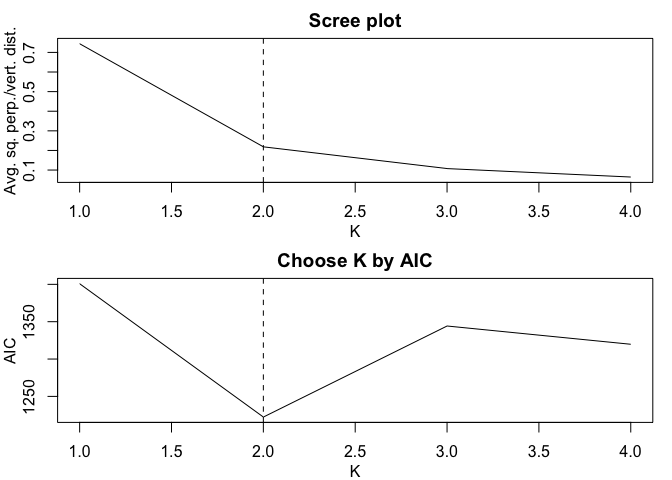
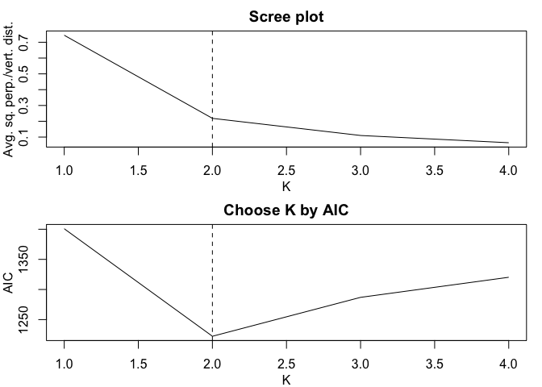

Installation
------------

You can install gR2 from GitHub with:

``` r
#install.packages("devtools")
devtools::install_github("lijy03/gR2")
?gR2
```

Examples
--------

### Load packages and simulate data:

``` r
library(mvtnorm)
library(gR2)

#Simulates data from a mixture of two bivariate normal distributions
simulateData<-function(seed=1){
  set.seed(seed)
  n=200 #sample size
  K=2 #number of components (lines)
  p_s=c(0.5,0.5) #proportions of components
  mu_s=list(c(0,-2),c(0,2)) #mean vectors
  Sigma_s=list(rbind(c(1,0.8),c(0.8,1)),rbind(c(1,0.8),c(0.8,1))) #covariance matrices
  z=sample(1:K,size=n,prob=p_s,replace=TRUE) #line memberships
  data=matrix(0,nrow=n,ncol=2)
  for (i in 1:K){
    idx=which(z==i)
    data[idx,]=rmvnorm(n=length(idx),mean=mu_s[[i]],sigma=Sigma_s[[i]])
  }
  return(cbind(data,z))
}

data<-simulateData(seed=7)
x<-data[,1]
y<-data[,2]
z<-data[,3]
```

### Typical uses of gR2():

``` r
#Specified scenario
gR2(x,y,z) #No inference
```

    ## $estimate
    ## [1] 0.5693829

``` r
gR2(x,y,z,inference=TRUE) #Inference
```

    ## $estimate
    ## [1] 0.5693829
    ## 
    ## $conf.level
    ## [1] 0.95
    ## 
    ## $conf.int
    ## [1] 0.4788409 0.6599248
    ## 
    ## $p.val
    ## [1] 3.303775e-35

``` r
#Unspecified scenario (K chosen)
gR2(x,y,K=2) #No inference
```

    ## $estimate
    ## [1] 0.5693829
    ## 
    ## $K
    ## [1] 2
    ## 
    ## $membership
    ##   [1] 1 2 2 2 2 1 2 1 2 2 2 2 1 2 2 2 1 2 1 2 1 2 1 1 1 2 1 2 1 2 1 2 2 2 2
    ##  [36] 1 2 1 1 2 1 2 1 2 1 2 2 1 1 1 1 1 1 1 1 2 2 2 2 2 2 1 1 1 1 1 2 2 2 2
    ##  [71] 2 1 1 1 2 1 2 2 1 1 1 1 2 1 2 2 2 1 2 2 2 2 1 2 1 1 1 2 1 2 2 2 2 2 1
    ## [106] 2 1 2 1 2 1 2 2 1 1 1 1 1 2 1 1 2 1 2 1 2 1 2 1 2 1 1 1 1 1 1 1 1 1 1
    ## [141] 1 1 2 1 2 1 2 1 2 1 2 1 2 2 2 1 2 1 1 1 1 1 1 1 1 1 2 1 2 2 2 1 2 1 2
    ## [176] 1 2 2 1 1 1 2 2 1 1 1 1 2 1 2 2 1 1 1 2 2 2 1 2 2

``` r
gR2(x,y,K=2,inference=TRUE) #Inference
```

    ## $estimate
    ## [1] 0.5693829
    ## 
    ## $conf.level
    ## [1] 0.95
    ## 
    ## $conf.int
    ## [1] 0.4788409 0.6599248
    ## 
    ## $p.val
    ## [1] 3.303775e-35
    ## 
    ## $K
    ## [1] 2
    ## 
    ## $membership
    ##   [1] 1 2 2 2 2 1 2 1 2 2 2 2 1 2 2 2 1 2 1 2 1 2 1 1 1 2 1 2 1 2 1 2 2 2 2
    ##  [36] 1 2 1 1 2 1 2 1 2 1 2 2 1 1 1 1 1 1 1 1 2 2 2 2 2 2 1 1 1 1 1 2 2 2 2
    ##  [71] 2 1 1 1 2 1 2 2 1 1 1 1 2 1 2 2 2 1 2 2 2 2 1 2 1 1 1 2 1 2 2 2 2 2 1
    ## [106] 2 1 2 1 2 1 2 2 1 1 1 1 1 2 1 1 2 1 2 1 2 1 2 1 2 1 1 1 1 1 1 1 1 1 1
    ## [141] 1 1 2 1 2 1 2 1 2 1 2 1 2 2 2 1 2 1 1 1 1 1 1 1 1 1 2 1 2 2 2 1 2 1 2
    ## [176] 1 2 2 1 1 1 2 2 1 1 1 1 2 1 2 2 1 1 1 2 2 2 1 2 2

``` r
#Unspecified scenario (K not chosen)
gR2(x,y) #No inference
```

    ## Candidate K values: 1, 2, 3, 4



    ## The K value chosen by AIC is 2.

    ## $estimate
    ## [1] 0.5693829
    ## 
    ## $K
    ## [1] 2
    ## 
    ## $membership
    ##   [1] 1 2 2 2 2 1 2 1 2 2 2 2 1 2 2 2 1 2 1 2 1 2 1 1 1 2 1 2 1 2 1 2 2 2 2
    ##  [36] 1 2 1 1 2 1 2 1 2 1 2 2 1 1 1 1 1 1 1 1 2 2 2 2 2 2 1 1 1 1 1 2 2 2 2
    ##  [71] 2 1 1 1 2 1 2 2 1 1 1 1 2 1 2 2 2 1 2 2 2 2 1 2 1 1 1 2 1 2 2 2 2 2 1
    ## [106] 2 1 2 1 2 1 2 2 1 1 1 1 1 2 1 1 2 1 2 1 2 1 2 1 2 1 1 1 1 1 1 1 1 1 1
    ## [141] 1 1 2 1 2 1 2 1 2 1 2 1 2 2 2 1 2 1 1 1 1 1 1 1 1 1 2 1 2 2 2 1 2 1 2
    ## [176] 1 2 2 1 1 1 2 2 1 1 1 1 2 1 2 2 1 1 1 2 2 2 1 2 2

``` r
gR2(x,y,inference=TRUE) #Inference
```

    ## Candidate K values: 1, 2, 3, 4



    ## The K value chosen by AIC is 2.

    ## $estimate
    ## [1] 0.5693829
    ## 
    ## $conf.level
    ## [1] 0.95
    ## 
    ## $conf.int
    ## [1] 0.4788409 0.6599248
    ## 
    ## $p.val
    ## [1] 3.303775e-35
    ## 
    ## $K
    ## [1] 2
    ## 
    ## $membership
    ##   [1] 1 2 2 2 2 1 2 1 2 2 2 2 1 2 2 2 1 2 1 2 1 2 1 1 1 2 1 2 1 2 1 2 2 2 2
    ##  [36] 1 2 1 1 2 1 2 1 2 1 2 2 1 1 1 1 1 1 1 1 2 2 2 2 2 2 1 1 1 1 1 2 2 2 2
    ##  [71] 2 1 1 1 2 1 2 2 1 1 1 1 2 1 2 2 2 1 2 2 2 2 1 2 1 1 1 2 1 2 2 2 2 2 1
    ## [106] 2 1 2 1 2 1 2 2 1 1 1 1 1 2 1 1 2 1 2 1 2 1 2 1 2 1 1 1 1 1 1 1 1 1 1
    ## [141] 1 1 2 1 2 1 2 1 2 1 2 1 2 2 2 1 2 1 1 1 1 1 1 1 1 1 2 1 2 2 2 1 2 1 2
    ## [176] 1 2 2 1 1 1 2 2 1 1 1 1 2 1 2 2 1 1 1 2 2 2 1 2 2

### Complete list of uses of gR2():

``` r
#Basic categories: specified, unspecified K chosen, unspecified K not chosen
#Inference: no inference, inference (general), inference (bivariate normal)
#If unspecified: MA, LM
#Total number of scenarios: 3+3+3+6=15
#If specified + no inference, then output a list of one item: estimate.
#If specified + inference, then output a list of four items: estimate, conf.level, conf.int, and p.val.
#If unspecified + no inference, then output a list of three item: estimate, K, membership.
#If unspecified + inference, then output a list of six items: estimate, conf.level, conf.int, p.val, K, membership.

#Scenario 1: specified, no inference
#Output: a list of one item: estimate
result1<-gR2(x,y,z)
result1

#Scenario 2: specified, inference (general)
#Output: a list of four items: estimate, conf.level, conf.int, and p.val
result2<-gR2(x,y,z,inference=TRUE)
result2

#Scenario 3: specified, inference (bivariate normal)
#Output: a list of four items: estimate, conf.level, conf.int, and p.val
result3<-gR2(x,y,z,inference=TRUE,method="binorm")
result3

#Scenario 4: unspecified K chosen, no inference, MA
#Output: a list of three item: estimate, K, membership
result4<-gR2(x,y,K=2)
result4

#Scenario 5: unspecified K chosen, inference (general), MA
#Output: a list of six items: estimate, conf.level, conf.int, p.val, K, membership
result5<-gR2(x,y,K=2,inference=TRUE)
result5

#Scenario 6: unspecified K chosen, inference (bivariate normal), MA
#Output: a list of six items: estimate, conf.level, conf.int, p.val, K, membership
result6<-gR2(x,y,K=2,inference=TRUE,method="binorm")
result6

#Scenario 7: unspecified K not chosen, no inference, MA
#Output: a list of three item: estimate, K, membership
result7<-gR2(x,y)
result7

#Scenario 8: unspecified K not chosen, inference (general), MA
#Output: a list of six items: estimate, conf.level, conf.int, p.val, K, membership
result8<-gR2(x,y,inference=TRUE)
result8

#Scenario 9: unspecified K not chosen, inference (bivariate normal), MA
#Output: a list of six items: estimate, conf.level, conf.int, p.val, K, membership
result9<-gR2(x,y,inference=TRUE,method="binorm")
result9

#Scenario 10: unspecified K chosen, no inference, LM
#Output: a list of three item: estimate, K, membership
result10<-gR2(x,y,K=2,regressionMethod="LM")
result10

#Scenario 11: unspecified K chosen, inference (general), LM
#Output: a list of six items: estimate, conf.level, conf.int, p.val, K, membership
result11<-gR2(x,y,K=2,regressionMethod="LM",inference=TRUE)
result11

#Scenario 12: unspecified K chosen, inference (bivariate normal), LM
#Output: a list of six items: estimate, conf.level, conf.int, p.val, K, membership
result12<-gR2(x,y,K=2,regressionMethod="LM",inference=TRUE,method="binorm")
result12

#Scenario 13: unspecified K not chosen, no inference, LM
#Output: a list of three item: estimate, K, membership
result13<-gR2(x,y,regressionMethod="LM")
result13

#Scenario 14: unspecified K not chosen, inference (general), LM
#Output: a list of six items: estimate, conf.level, conf.int, p.val, K, membership
result14<-gR2(x,y,regressionMethod="LM",inference=TRUE)
result14

#Scenario 15: unspecified K not chosen, inference (bivariate normal), LM
#Output: a list of six items: estimate, conf.level, conf.int, p.val, K, membership
result15<-gR2(x,y,regressionMethod="LM",inference=TRUE,method="binorm")
result15
```
