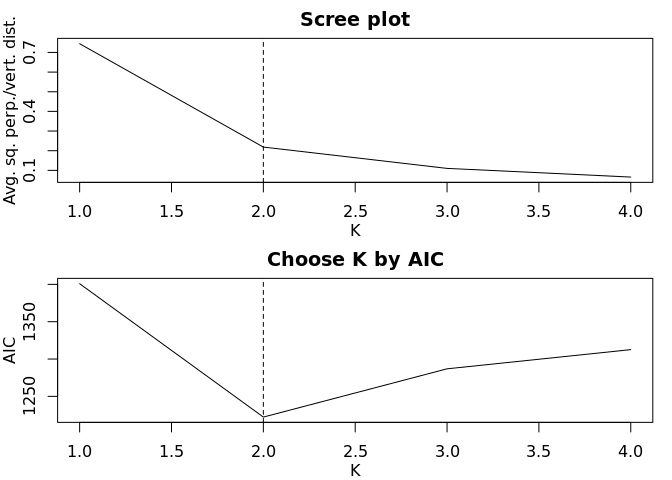

## Installation

We recommend that users install this package on Linux. If Windows or
macOS is used, you may run into compilation errors when trying to
install the main branch of the package, due to issues that are
introduced with operating system updates.

To address potential compilation issues, we provide three branches of
the package with increasing ease of installation but decreasing
computational efficiency:

1.  **Main branch**, which uses both Rcpp and RcppParallel (fastest).
2.  A branch named **RcppVersion**, which only uses Rcpp (about 10x
    slower).
3.  A branch named **RVersion**, which uses neither Rcpp nor
    RcppParallel (slowest).

You may follow these steps to install the package:

``` r
# install.packages("devtools")

#Step 1. Try installing the main branch:
devtools::install_github("lijy03/gR2")

#Step 2. If Step 1 fails, try installing the branch named RcppVersion:
devtools::install_github("lijy03/gR2",ref="RcppVersion")

#Step 3. If Step 2 also fails, try installing the branch named RVersion:
devtools::install_github("lijy03/gR2",ref="RVersion")
```

One known issue is that at Step 1, if you are using macOS, you may
encounter this error: *clang: error: unsupported option ‘-fopenmp’*

To resolve this issue, you may follow the instructions found here
<https://thecoatlessprofessor.com/programming/cpp/r-compiler-tools-for-rcpp-on-macos/>,
or here <https://github.com/rmacoslib/r-macos-rtools>. Basically, what
you would do is download an macOS package (r-macos-rtools) and install
it. Then you may try Step 1 again.

We summarize the key differences between the three branches here:

| Branch      | Speed            | Needs compilation | Klines algorithm implemented in | Parallelization mechanism | To ensure reproducibility                       | Special note for Windows users |
| ----------- | ---------------- | ----------------- | ------------------------------- | ------------------------- | ----------------------------------------------- | ------------------------------ |
| Main        | Fastest          | Yes               | Rcpp                            | RcppParallel              | set.seed()                                      |                                |
| RcppVersion | About 10x slower | Yes               | Rcpp                            | mclapply()                | RNGkind(“L’Ecuyer-CMRG”) followed by set.seed() | Use mc.cores=1 to avoid error. |
| RVersion    | Slowest          | No                | R                               | mclapply()                | RNGkind(“L’Ecuyer-CMRG”) followed by set.seed() | Use mc.cores=1 to avoid error. |

## Examples

### Simulate data:

``` r
#Simulates data from a mixture of two bivariate normal distributions
simulateData<-function(seed=1){
  set.seed(seed)
  n=200 #Sample size
  K=2 #Number of components (lines)
  p_s=c(0.5,0.5) #Proportions of components
  mu_s=list(c(0,-2),c(0,2)) #mean vectors
  Sigma_s=list(rbind(c(1,0.8),c(0.8,1)),rbind(c(1,0.8),c(0.8,1))) #Covariance matrices
  z=sample(1:K,size=n,prob=p_s,replace=TRUE) #Line memberships
  data=matrix(0,nrow=n,ncol=2)
  for (i in 1:K){
    idx=which(z==i)
    data[idx,]=mvtnorm::rmvnorm(n=length(idx),mean=mu_s[[i]],sigma=Sigma_s[[i]])
  }
  return(cbind(data,z))
}

data<-simulateData(seed=7)
x<-data[,1]
y<-data[,2]
z<-data[,3]
```

### Typical uses of gR2():

``` r
library(gR2)

# RNGkind("L'Ecuyer-CMRG") #This is only needed if either RcppVersion or RVersion is used.
set.seed(11) #Use set.seed() to make gR2 reproducible in the unspecified scenario

#Specified scenario
result<-gR2(x,y,z) #No inference
result<-gR2(x,y,z,inference=TRUE) #Inference

#Unspecified scenario (K chosen)
result<-gR2(x,y,K=2) #No inference
result<-gR2(x,y,K=2,inference=TRUE) #Inference

#Unspecified scenario (K not chosen)
#result<-gR2(x,y) #No inference
result<-gR2(x,y,inference=TRUE) #Inference
```

    ## Candidate K values: 1, 2, 3, 4
    ## The K value chosen by AIC is 2.

<!-- -->

### A more comprehensive list of uses of gR2():

``` r
#Basic categories: specified, unspecified K chosen, unspecified K not chosen
#Inference: no inference, inference (general), inference (bivariate normal)
#If unspecified: MA, LM
#Total number of scenarios: 3 (specified) + 3 (unspecified K chosen, MA) + 3 (unspecified K not chosen, MA) + 6 (LM) = 15
#If specified + no inference, then output a list of one item: estimate.
#If specified + inference, then output a list of four items: estimate, conf.level, conf.int, and p.val.
#If unspecified + no inference, then output a list of three item: estimate, K, membership.
#If unspecified + inference, then output a list of six items: estimate, conf.level, conf.int, p.val, K, membership.

#Scenario 1: specified, no inference
#Output: a list of one item: estimate
result1<-gR2(x,y,z)
result1

#Scenario 2: specified, inference (general)
#Output: a list of four items: estimate, conf.level, conf.int, and p.val
result2<-gR2(x,y,z,inference=TRUE)
result2

#Scenario 3: specified, inference (bivariate normal)
#Output: a list of four items: estimate, conf.level, conf.int, and p.val
result3<-gR2(x,y,z,inference=TRUE,method="binorm")
result3

#Scenario 4: unspecified K chosen, no inference, MA
#Output: a list of three item: estimate, K, membership
result4<-gR2(x,y,K=2)
result4

#Scenario 5: unspecified K chosen, inference (general), MA
#Output: a list of six items: estimate, conf.level, conf.int, p.val, K, membership
result5<-gR2(x,y,K=2,inference=TRUE)
result5

#Scenario 6: unspecified K chosen, inference (bivariate normal), MA
#Output: a list of six items: estimate, conf.level, conf.int, p.val, K, membership
result6<-gR2(x,y,K=2,inference=TRUE,method="binorm")
result6

#Scenario 7: unspecified K not chosen, no inference, MA
#Output: a list of three item: estimate, K, membership
result7<-gR2(x,y)
result7

#Scenario 8: unspecified K not chosen, inference (general), MA
#Output: a list of six items: estimate, conf.level, conf.int, p.val, K, membership
result8<-gR2(x,y,inference=TRUE)
result8

#Scenario 9: unspecified K not chosen, inference (bivariate normal), MA
#Output: a list of six items: estimate, conf.level, conf.int, p.val, K, membership
result9<-gR2(x,y,inference=TRUE,method="binorm")
result9

#Scenario 10: unspecified K chosen, no inference, LM
#Output: a list of three item: estimate, K, membership
result10<-gR2(x,y,K=2,regressionMethod="LM")
result10

#Scenario 11: unspecified K chosen, inference (general), LM
#Output: a list of six items: estimate, conf.level, conf.int, p.val, K, membership
result11<-gR2(x,y,K=2,regressionMethod="LM",inference=TRUE)
result11

#Scenario 12: unspecified K chosen, inference (bivariate normal), LM
#Output: a list of six items: estimate, conf.level, conf.int, p.val, K, membership
result12<-gR2(x,y,K=2,regressionMethod="LM",inference=TRUE,method="binorm")
result12

#Scenario 13: unspecified K not chosen, no inference, LM
#Output: a list of three item: estimate, K, membership
result13<-gR2(x,y,regressionMethod="LM")
result13

#Scenario 14: unspecified K not chosen, inference (general), LM
#Output: a list of six items: estimate, conf.level, conf.int, p.val, K, membership
result14<-gR2(x,y,regressionMethod="LM",inference=TRUE)
result14

#Scenario 15: unspecified K not chosen, inference (bivariate normal), LM
#Output: a list of six items: estimate, conf.level, conf.int, p.val, K, membership
result15<-gR2(x,y,regressionMethod="LM",inference=TRUE,method="binorm")
result15
```
