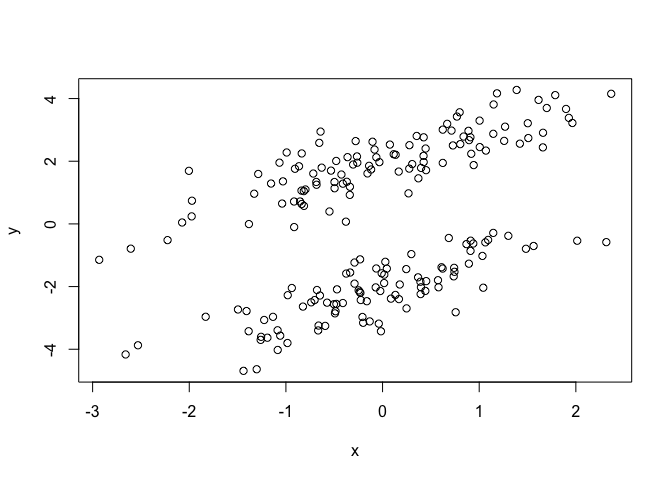
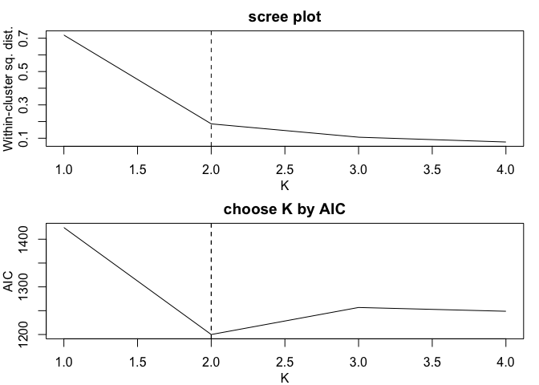

<!-- README.md is generated from README.Rmd. Please edit that file -->
gR2
===

This R package gR2 contains a function to compute the supervised and unsupervised sample generalized R square measures. The function also implements the K-lines clustering algorithm and allows an automatic choice of K for the unsupervised case. Statistical inference of the supervised and unsupervised population generalied R square measures is also included.

Installation
------------

You can install gR2 from github with:

``` r
# install.packages("devtools")
devtools::install_github("lijy03/gR2")
```

Example
-------

This is a basic example which shows you how to solve a common problem:

``` r
# generate data from a bivariate normal mixture model
library(mvtnorm)
library(parallel)
K = 2 # number of components (lines)
p_s = c(0.5, 0.5) # proportions of components
mu_s = list(c(0,-2), c(0,2)) # mean vectors
Sigma_s = list(rbind(c(1,0.8),c(0.8,1)), rbind(c(1,0.8),c(0.8,1))) # covariance matrices
z = sample(1:K, size=n, prob=p_s, replace=T) # line memberships
data = matrix(0, nrow=n, ncol=2)
for (i in 1:K) {
  idx = which(z==i)
  data[idx,] = rmvnorm(n=length(idx), mean=mu_s[[i]], sigma=Sigma_s[[i]])
}
x = data[,1]
y = data[,2]

# plot the data
plot(x, y)
```



``` r

# supervised sample generalized R square
gR2(x, y, z) # without inference
#> $estimate
#> [1] 0.6389837
gR2(x, y, z, inference=TRUE) # with inference
#> $estimate
#> [1] 0.6389837
#> 
#> $conf.level
#> [1] 0.95
#> 
#> $conf.int
#> [1] 0.5647868 0.7131806
#> 
#> $p.val
#> [1] 3.199748e-64

# unsupervised sample generalized R square
gR2(x, y, K=2, mc.cores=2) # with K specified, without inference
#> $estimate
#> [1] 0.6389837
#> 
#> $K
#> [1] 2
#> 
#> $membership
#>   [1] 2 1 2 2 1 1 2 1 2 2 1 2 1 1 2 2 1 1 2 2 2 2 1 2 2 2 2 1 1 1 2 1 2 1 1
#>  [36] 1 1 2 1 1 2 1 1 2 2 2 2 1 1 1 2 2 1 2 2 2 1 2 1 2 2 1 2 1 2 1 2 1 2 1
#>  [71] 2 1 1 1 2 1 2 1 2 1 2 2 1 1 2 2 1 2 1 2 2 1 2 1 1 2 1 2 2 2 2 2 2 2 1
#> [106] 2 1 1 2 1 2 1 2 2 2 1 1 1 2 1 1 2 2 1 1 2 1 2 2 1 1 2 1 2 1 1 2 2 2 1
#> [141] 2 2 2 2 2 2 2 1 1 2 2 1 1 1 1 1 1 1 2 2 2 2 1 2 1 2 1 1 1 1 1 1 1 2 2
#> [176] 1 2 2 2 2 2 2 1 2 1 2 2 1 2 2 1 2 2 1 1 2 1 2 1 2
gR2(x, y, inference=TRUE, mc.cores=2) # without K specified, with inference
#> Candidate K values: 1, 2, 3, 4
```



    #> The K value chosen by AIC is 2
    #> $estimate
    #> [1] 0.6389837
    #> 
    #> $conf.level
    #> [1] 0.95
    #> 
    #> $conf.int
    #> [1] 0.5647868 0.7131806
    #> 
    #> $p.val
    #> [1] 3.199748e-64
    #> 
    #> $K
    #> [1] 2
    #> 
    #> $membership
    #>   [1] 1 2 1 1 2 2 1 2 1 1 2 1 2 2 1 1 2 2 1 1 1 1 2 1 1 1 1 2 2 2 1 2 1 2 2
    #>  [36] 2 2 1 2 2 1 2 2 1 1 1 1 2 2 2 1 1 2 1 1 1 2 1 2 1 1 2 1 2 1 2 1 2 1 2
    #>  [71] 1 2 2 2 1 2 1 2 1 2 1 1 2 2 1 1 2 1 2 1 1 2 1 2 2 1 2 1 1 1 1 1 1 1 2
    #> [106] 1 2 2 1 2 1 2 1 1 1 2 2 2 1 2 2 1 1 2 2 1 2 1 1 2 2 1 2 1 2 2 1 1 1 2
    #> [141] 1 1 1 1 1 1 1 2 2 1 1 2 2 2 2 2 2 2 1 1 1 1 2 1 2 1 2 2 2 2 2 2 2 1 1
    #> [176] 2 1 1 1 1 1 1 2 1 2 1 1 2 1 1 2 1 1 2 2 1 2 1 2 1

Please refer to the package [manual](https://github.com/lijy03/gR2/blob/master/gR2.pdf) for a full list of arguments and detailed usage.
